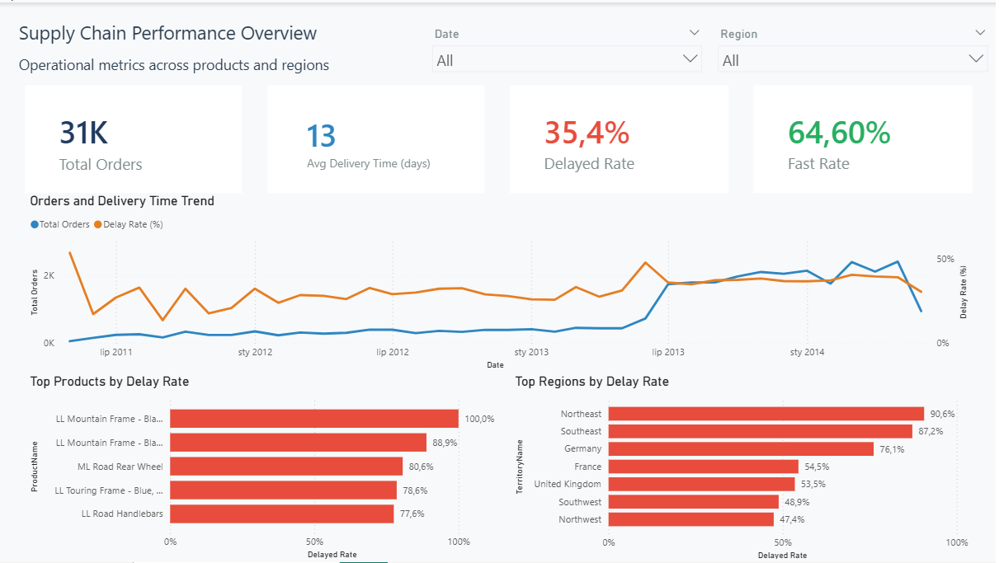

# Supply Chain Performance Dashboard

Supply chain performance dashboard analyzing delivery efficiency, delays, and operational bottlenecks using SQL Server and Power BI.

---

## 📊 Overview

This project presents a supply chain performance analysis built using SQL Server and Power BI.
The goal was to evaluate delivery efficiency, identify delays, and uncover operational bottlenecks.

---

## 🛠 Tools & Technologies

* SQL Server (data preparation, views)
* Power BI (data modeling & visualization)
* AdventureWorks dataset

---

## 📈 Key Metrics

* Total Orders
* Average Delivery Time (days)
* Delay Rate
* Fast Delivery Rate

---

## 🔍 Key Insights

* Increase in order volume correlates with higher delay rates
* Certain products show significantly higher delivery delays
* Specific regions contribute most to operational inefficiencies

---

## 🧱 Data Preparation

A SQL view was created to combine sales, product, and territory data.

Key steps:

* Calculated delivery time
* Defined delay conditions based on delivery duration
* Aggregated data at order level to avoid duplication

See `/sql/create_view_supply_chain.sql`

---

## 📊 Dashboard Preview

---

## 📌 Project Structure

* `/sql` → data preparation
* `/powerbi` → Power BI report
* `/images` → dashboard screenshots

---

## 🚀 How to Use

1. Load AdventureWorks database
2. Run SQL script from `/sql`
3. Open Power BI file

---

## 💡 Business Value

This dashboard helps identify delivery inefficiencies and supports data-driven decision-making in supply chain operations.
